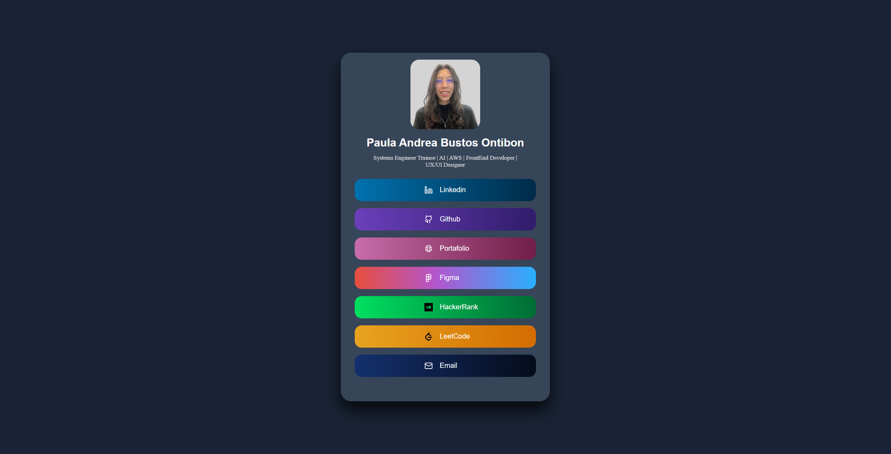

# Linktree - Paula Version

A customized version of the **Linktree** page, designed to centralize my official links and highlight my professional identity, all within a clean, modern layout.

## Features

* Display of social media and professional links in a visually appealing layout.
* Gradient backgrounds for each link with hover effects.
* Responsive design that adapts to different screen sizes.
* Clean, modern design with a profile image, title, and description.

## Technologies Used

* **HTML**: Structure of the page.
* **CSS**: Styling, including hover effects, background gradients, and responsive design.

## Installation

1. Clone the repository:

   ```bash
   git clone https://github.com/Paulidex/Linktree.git
   ```

2. Open the project in your preferred text editor or IDE.

3. Open `index.html` in your browser to view the page.

## Usage

* Click on any of the listed links to visit the respective social media or portfolio page.
* Hover over each link to see the background gradient animation.

## Screenshot

Here is a screenshot showing how the page looks:



## License

This project is licensed under the **Apache License 2.0** - see the [LICENSE](LICENSE) file for details.
